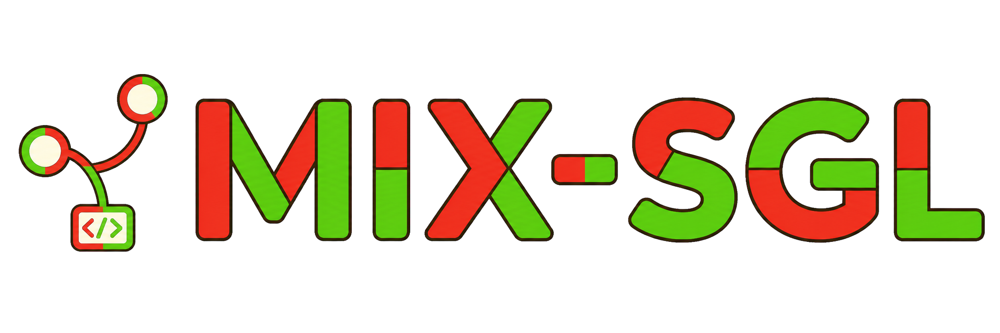

<div align="center" id="mix-sglang-top">



### Coordinated and fused sampling for SGLang

[SGLang Documentation](https://docs.sglang.io/) · [PDS Design](docs/developer_guide/pds_sample_synchronization.md) · [Windows PDS Runbook](docs/developer_guide/windows_pds_inference_runbook.md)

</div>

> [!IMPORTANT]
> mix-sglang is an experimental research fork of [SGLang](https://github.com/sgl-project/sglang). The PDS request parameters described below are temporary and are not yet a stable public API.

## What We Are Building

We are developing **prefill/decode/sample separation (PDS)** for SGLang. In a normal inference loop, each request samples a token as soon as its model forward pass produces logits. mix-sglang makes sampling an explicit scheduler stage: logits can be parked, coordinated with other requests, fused, and sampled later without blocking the rest of the server.

This separation lets multiple concurrent generations collaborate at token level. Each request can contribute its own filtered probability distribution; mix-sglang combines those distributions, samples one token, and advances every request in the group with that same token. The result is a practical foundation for experiments in multi-prompt generation, distribution-level model mixing, synchronized decoding, and sampling-time control.

## Main Features

- **Deferred sampling** — model forward passes produce logits with sampling disabled, and the scheduler safely resumes the requests when their sampling conditions are satisfied.
- **Request synchronization** — a request can wait for selected live request IDs before taking its next sample, without deadlocking on requests that have already finished.
- **Distribution fusion** — requests in the same sample group can combine their filtered token distributions with `avg_probs`. Optional per-request weights support weighted mixtures.
- **Shared-token generation** — a fused group samples once and writes the same token back to every member, keeping output IDs, sequence lengths, KV-cache progression, and streamed results aligned.
- **Tensor-parallel consistency** — fused sampling is performed once by the TP leader and broadcast to the other ranks so all workers advance with identical state.
- **Probability trajectories** — opted-in requests can return the selected token's probability under both the request's source distribution and the fused distribution.
- **Concurrent and staggered groups** — the scheduler handles multiple groups sharing a forward batch, as well as group members whose logits become ready at different times.
- **SGLang serving foundation** — the project retains SGLang's high-throughput runtime, continuous batching, prefix caching, distributed execution, broad model support, and OpenAI-compatible serving interfaces.

## How PDS Works

For each decoding step, a request moves through the following path:

1. The model forward pass computes logits with immediate sampling disabled.
2. The scheduler stores the result as pending sampling work.
3. PDS waits until the request's live dependencies or sample-group members are ready.
4. Each request's temperature and top-k/top-p/min-p rules produce a normalized source distribution.
5. The scheduler combines the distributions and samples one token from the fused result.
6. That token is propagated through SGLang's normal result-processing and decode-admission paths.

For two equally weighted requests, the current fusion rule is:

```text
p_a = normalize(filter(logits_a, sampling_params_a))
p_b = normalize(filter(logits_b, sampling_params_b))
p_fused = (p_a + p_b) / 2
next_token ~ p_fused
```

The implementation averages probabilities, not raw logits.

## Request Example

Send the requests concurrently and give them the same sample-group name:

```json
{
  "rid": "mix_math",
  "text": "What is 1 + 1?",
  "sampling_params": {
    "temperature": 0.6,
    "top_p": 0.95,
    "top_k": 20,
    "max_new_tokens": 128,
    "custom_params": {
      "__pds_sample_group": "math_poem",
      "__pds_fuse_method": "avg_probs",
      "__pds_fuse_weight": 1.0,
      "__pds_return_prob_trajectory": true
    }
  }
}
```

```json
{
  "rid": "mix_poem",
  "text": "Write a short classical poem.",
  "sampling_params": {
    "temperature": 0.6,
    "top_p": 0.95,
    "top_k": 20,
    "max_new_tokens": 128,
    "custom_params": {
      "__pds_sample_group": "math_poem",
      "__pds_fuse_method": "avg_probs",
      "__pds_fuse_weight": 1.0
    }
  }
}
```

Both requests should receive identical output token IDs. The first response also includes two arrays in `meta_info`, aligned with `output_ids`:

- `pds_source_token_probs`
- `pds_fused_token_probs`

For request-ID synchronization without distribution fusion, use `__pds_wait_for_rids` instead.

## Getting Started

mix-sglang follows the standard SGLang installation and server interfaces. Start with the upstream guides, then use the PDS-specific request parameters above:

- [Install SGLang](https://docs.sglang.io/get_started/install.html)
- [SGLang Quick Start](https://docs.sglang.io/basic_usage/send_request.html)
- [OpenAI-Compatible APIs](https://docs.sglang.io/basic_usage/openai_api_completions.html)

For the tested local Windows workflow in this repository:

```powershell
.\scripts\pds\start_mix_pds_local.ps1

$env:MIX_PDS_API_KEY = (Get-Content .tmp_pds_run\mix_pds_local_api_key.txt -Raw).Trim()
python scripts\pds\smoke_mix_pds_stream.py

.\scripts\pds\stop_mix_pds_local.ps1
```

The scripts accept model, Python, host, and port overrides. See the [Windows PDS inference runbook](docs/developer_guide/windows_pds_inference_runbook.md) for the complete environment setup and troubleshooting notes.

## Project Status and Limitations

The current implementation is intended for research and validation:

- `avg_probs` is the only distribution-fusion method currently implemented.
- PDS controls live under temporary `sampling_params.custom_params` keys.
- Group members should use compatible vocabularies and sampling configurations.
- The Python-level fusion path prioritizes correctness and debuggability; a dedicated kernel path is future work.
- API stability, performance tuning, broader backend coverage, and more fusion policies are still in progress.

## Documentation

- [PDS sample synchronization and distribution fusion](docs/developer_guide/pds_sample_synchronization.md) — design, scheduler state machine, request API, failure modes, and verification.
- [Windows PDS inference runbook](docs/developer_guide/windows_pds_inference_runbook.md) — reproducible local launch, paired-request tests, and process cleanup.

## Upstream SGLang

mix-sglang is built on SGLang, a high-performance serving framework for large language and multimodal models. SGLang provides the production runtime, model integrations, hardware backends, distributed execution, and serving APIs on which this research is based.

For the full upstream feature set, community resources, benchmarks, and contribution guide, visit the [SGLang repository](https://github.com/sgl-project/sglang) and [documentation](https://docs.sglang.io/).

## Acknowledgments

We thank the SGLang contributors and the projects that shaped its design, including [Guidance](https://github.com/guidance-ai/guidance), [vLLM](https://github.com/vllm-project/vllm), [LightLLM](https://github.com/ModelTC/lightllm), [FlashInfer](https://github.com/flashinfer-ai/flashinfer), [Outlines](https://github.com/outlines-dev/outlines), and [LMQL](https://github.com/eth-sri/lmql).
